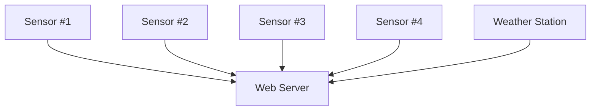
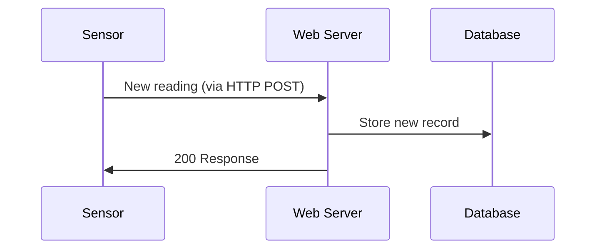
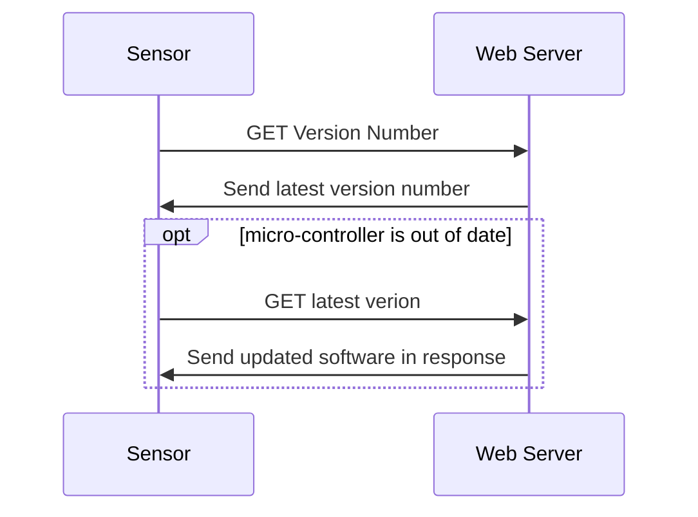

# DISCLAIMER: WORK IN PROGRESS
This project and this document are a work in progress and is being created to be used as a learning experience for creating software and computer systems for solving real world problems. 

# Garden Station Project
Garden station is a web application that tracks data from my garden and displays it on a web page. It is designed using the LAMP stack framework.

The following data will be tracked:
- Moisture levels of the soil
- Temperature
- Wind speed and direction
- Air pressure

There should also be a live feed of the garden from the front.

Initially the web page should only be accessible to local traffic so the data can be accessed from home or devices connected via VPN. 

## Goals
This aim of this project is to allow me to monitor the current weather conditions and state of my garden. Using soil moisture data I can more accurately respond in real time to plants in distress and adjust irrigation timings at a more granular level and make better use of the limited water resources we have. 

This data will also allow me to get a better understanding of the day to day operation of my garden and I can see how and why the plants I have are acting the way that they do.

The ulterior motive for this project is to use it as an example of the skills I possess for future potential employment. This project will be used to demonstrate my skills and ability to use software and technology to solve a problem. 

The competencies this project demonstrates cover a variety of areas including software development, computer networking, cyber security, project management, creative thinking, and communication skills.

#### Hard Skills Demonstrated
- Developing a web app using Flask (Python)
- Utilising a database management system to solve a problem
- Running an Apache web server on a local network
- Utilising HTTP methods to transfer information over local network
- Developing software running on Arduino
- Capability using Markdown, mermaid.js to describe ideas
- Using git version control software
- Using the GitHub platform to development a software solution
- Web security

#### Soft Skills Demonstrated
- Writing design documentation 
- Communication skills used to describe technical concepts
- Project planning, management and completion
- Familiarity with Information Security concepts used to design and develop a computer system with security in mind

# Design
This project will rely on micro-controllers in the field collecting data and then sending that data back to a server at regular intervals. The server hosts a web-server and a database containing all recorded data. The server also stores the latest software version to be running on the micro-controllers to enable in field updates.

## Web Server
The web server will be run using Apache 2.4. Currently using it on a Windows installation however later the intent is to run it on a linux box vm (possibly Azure based?). 

The back-end is developed using Flask python. The web server receives data from the sensors in the field and serves web requests to users wishing to view the data. The web-server receives HTTP POST requests containing to update the database with. A database located on the same device as the web server will contain all readings recorded and this data will then be used by the web server when serving web pages. 

The web server will also be used to transmit software updates to the micro-controllers so that they can be updated without having to be removed and physically updated.  

#### Data Recording Sequence

#### Micro-Controller Update
To conserve battery power and maintain security on the devices, they will request the latest version number at regular intervals and update in this way rather than have an open port that is waiting for updates to be pushed to it.

 
## Micro-Controllers

## Database

DBMS: MySQL database with the following tables:   
- Weather records
- Soil Moisture

#### Weather Records
Primary Key: weather_id - TIMESTAMP  
temperature - SMALLINT  
air_pressure - INT  
wind_direction - CHAR  
humidity - INT  

#### Soil Moisture
Primary Key: soil_moisture_id - TIMESTAMP  
moisture_level - FLOAT  
location - CHAR  
device_id - SMALLINT  
