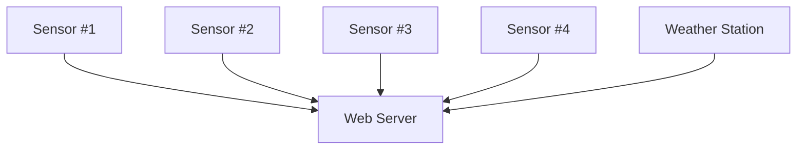
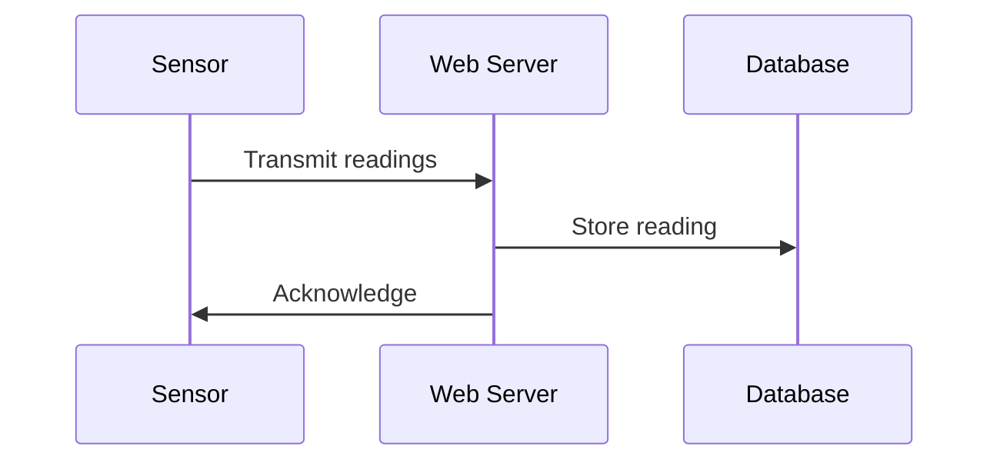
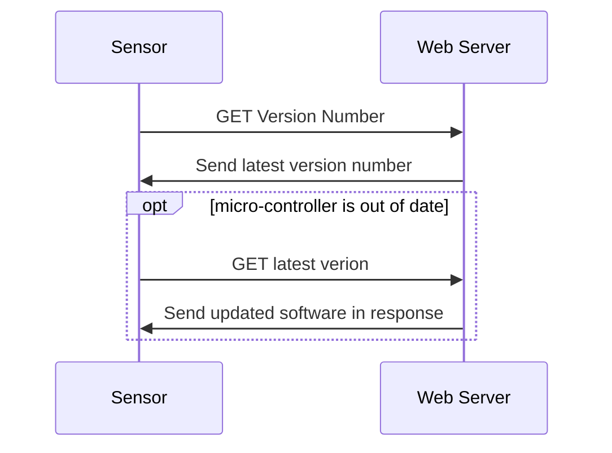

# Design
This project will rely on micro-controllers in the field collecting data and then sending that data back to a server at regular intervals. The server hosts a web-server and a database containing all recorded data. The server also stores the latest software version to be running on the micro-controllers to enable in field updates.

## Web Server
The web server will be run using Apache 2.4. The server should be able to be used in a standalone environment either on a single microcomputer or as a cloud based service.

The back-end is developed using Flask python. The web server receives data from the sensors in the field and serves web requests to users wishing to view the data. The web-server receives transmissions from sensors in the field containing new readings. A database located on the same device as the web server will contain all readings recorded and this data will then be used by the web server when serving web pages. 

The web server will also be used to transmit software updates to the micro-controllers so that they can be updated without having to be removed and physically updated.  

#### Wireless Data Transfer
Investigate method to use for data transfer from micro-controllers to the web-server.

#### Data Recording Sequence

#### Micro-Controller Update
To enable easy updating of micro-controller software a wireless update system will be setup. This system will prevent the need to physically plug the devices into a computer to install new updates. 

Looking at options for initiating update from sensors regularly or pushing updates to the sensors depending on wireless technology used.

Possible sensor initiated design:

 
## Micro-Controllers
Looking at using Arduinos for the sensors and a Raspberry Pi as the web server.

## Database
A relational database on the web server will be used to store the readings received from the sensors in the field. This database needs to be compatible with Python, lightweight, and easily transportable for backup.

DBMS: SQLite database with the following tables:   
- Weather records
- Soil Moisture

#### Weather Records
Primary Key: weather_id - TIMESTAMP  
temperature - SMALLINT  
air_pressure - INT  
wind_direction - CHAR  
humidity - INT  

#### Soil Moisture
Primary Key: soil_moisture_id - TIMESTAMP  
moisture_level - FLOAT  
location - CHAR  
device_id - SMALLINT  
