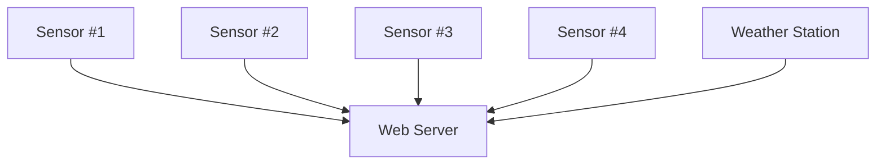
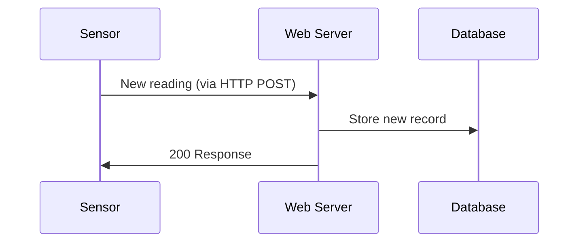
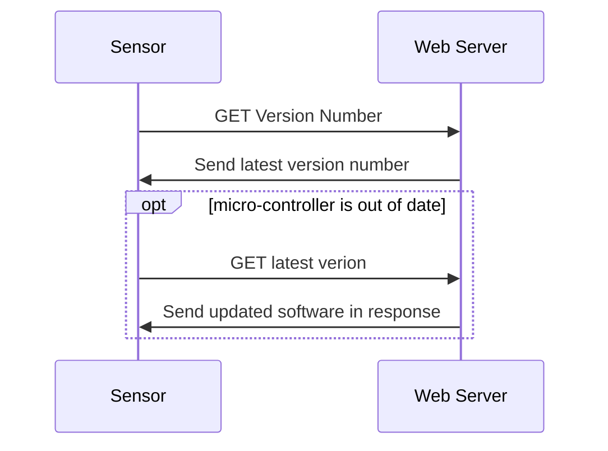

# Design
This project will rely on micro-controllers in the field collecting data and then sending that data back to a server at regular intervals. The server hosts a web-server and a database containing all recorded data. The server also stores the latest software version to be running on the micro-controllers to enable in field updates.

## Web Server
The web server will be run using Apache 2.4. Currently using it on a Windows installation however later the intent is to run it on a linux box vm (possibly Azure based?). 

The back-end is developed using Flask python. The web server receives data from the sensors in the field and serves web requests to users wishing to view the data. The web-server receives HTTP POST requests containing to update the database with. A database located on the same device as the web server will contain all readings recorded and this data will then be used by the web server when serving web pages. 

The web server will also be used to transmit software updates to the micro-controllers so that they can be updated without having to be removed and physically updated.  

#### Wireless Data Transfer
Investigate method to use for data transfer from micro-controllers to the web-server.

#### Data Recording Sequence

#### Micro-Controller Update
To enable easy updating of micro-controller software a wireless update system will be setup. This system will prevent the need to physically plug the devices into a computer to install new updates. 

To conserve battery power and maintain security on the devices the devices will perform a version check with the web server. At regular intervals the devices will check the latest version number and update in this way rather than use an open port on the device that waits for updates to be pushed to it on demand.

The check can be performed with the data transfer.

 
## Micro-Controllers

## Database

DBMS: MySQL database with the following tables:   
- Weather records
- Soil Moisture

#### Weather Records
Primary Key: weather_id - TIMESTAMP  
temperature - SMALLINT  
air_pressure - INT  
wind_direction - CHAR  
humidity - INT  

#### Soil Moisture
Primary Key: soil_moisture_id - TIMESTAMP  
moisture_level - FLOAT  
location - CHAR  
device_id - SMALLINT  
