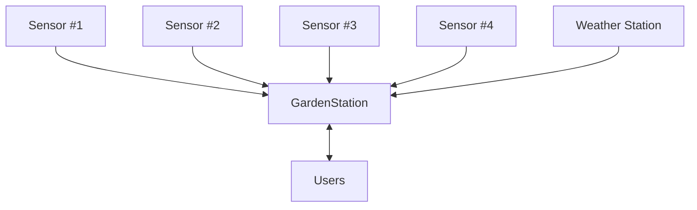

# Garden Station Project
Garden Station is a web application that uses micro-controllers with sensors to gather data in a garden and display that data in a web application. The web server uses a LAMP stack.

Garden Station is designed to track:
- Soil moisture levels
- Temperature
- Humidity
- Wind speed and direction
- Rainfall

Using multiple microcontrollers you are able to gather data in different sections of your garden and different types of data as required by your own needs.

# Wiki Contents Page
[[Goals/Roadmap | Project-Roadmap]]  
[[Design | Design]]  
[[Hardware | Hardware]]  

# Purpose
This aim of this project is to allow me to monitor the current weather conditions and state of my garden. Using soil moisture data I can more accurately respond in real time to plants in distress and adjust irrigation timings at a more granular level and make better use of the limited water resources we have. 

This data will also allow me to get a better understanding of the day to day operation of my garden and I can see how and why the plants I have are acting the way that they do.

The ulterior motive for this project is to use it as an example of the skills I possess for future potential employment. This project will be used to demonstrate my skills and ability to use software and technology to solve a problem. 

The competencies this project demonstrates cover a variety of areas including software development, computer networking, cyber security, project management, creative thinking, and communication skills.

#### Hard Skills Demonstrated
- Developing a web app using Flask (Python)
- Utilising a database management system to solve a problem
- Running an Apache web server on a local network
- Utilising HTTP methods to transfer information over local network
- Developing software running on Arduino
- Capability using Markdown, mermaid.js to describe ideas
- Using git version control software
- Using the GitHub platform to development a software solution
- Web security

#### Soft Skills Demonstrated
- Writing design documentation 
- Communication skills used to describe technical concepts
- Project planning, management and completion
- Familiarity with Information Security concepts used to design and develop a computer system with security in mind
